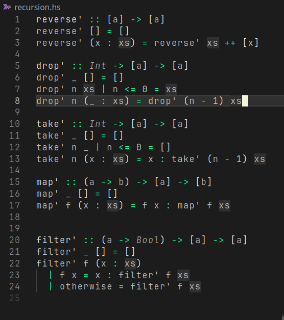

# darkvoid

<p align="center">
  
  
  
  
  
</p>

---

Have you ever been in a dark room, coding alone, surrounded by silence and the soft glow of your screen? That deep immersion, like a vast, quiet void, was the inspiration behind **darkvoid-theme**: an experience as profound as exploring an uncharted deep-sea trench lit only by strange, glowing creatures, or wandering through a cave where luminescent fungi paint the darkness... _Aah, the scenery!_

**darkvoid** captures that atmosphere, emphasizing only the essentials—your code, your commands—leaving distractions in shadow.

---

## Installation

You can easily install **darkvoid-theme** from the Visual Studio Code Marketplace.

- Open **Extensions** in VSCode (`Ctrl+Shift+X` or `Cmd+Shift+X` on macOS).
- Search for `darkvoid` and click **Install**.
- Select **darkvoid** from your theme options (`Ctrl+K Ctrl+T` or search for "Color Theme" in the command palette).

---

## Usage

After installing, activate **darkvoid**:

1. **Switching to darkvoid Theme**:

   - Open the command palette (`Ctrl+Shift+P` or `Cmd+Shift+P` on macOS).
   - Type `Preferences: Color Theme` and select **darkvoid**.

2. **Recommended Settings for the Best Experience**:
   - Disable bracket pair colorization for a minimalist look:
     ```json
     "editor.bracketPairColorization.enabled": false
     ```

---

## Customizations

Feel free to customize the theme according to your preference by adjusting the settings for:

- **Selection color**
- **LSP highlights**
- **UI elements (activity bar, status bar, etc.)**

For more details on customizing, refer to the VSCode documentation on [theme color customizations](https://code.visualstudio.com/docs/getstarted/theme-color-reference).

---

Enjoy the deep, immersive coding experience that **darkvoid** offers, and let your code glow softly in the surrounding quiet!🌌
